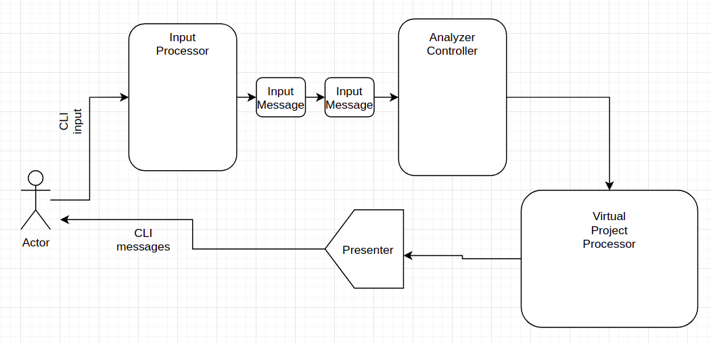

# Project analyzer

# Module 1: Parser
### * Notice: Algorithm will be modified for working on huge projects with big data.

"Virtual Project" - recursively go through the folder. Create a virtual in-memory structure of project.  called "virtual project".
"Project history" - if the project uses git engine for version control, use git commands and their outputs to get data about the project history, commiters, statistics, heatmaps and etc.

# Module 2: Core

Analyze parsed data. make asumptions, create statistics, heatmaps, history of the project and etc.

# Module 3: Processor

Takes "Virtual Project" as an input and using bunch of processings and calculations outputs useful data

# Building and using project
#### To Build jar, in the root of the project use:
    ./gradlew clean shadowJar
This will create build directory in the root of the project and then use:
#### To Run the program use:
    java -jar build/libs/project-analyzer.jar {arg?}
arg? is an optional argument. You can pass absolute/path/to/your/application. If arg? argument isn't specified current folder of jar file is used.
# Current Present Commands:
#### Name: COUNT_WITH_EXTENSION.
#### Command: find -xc {arg}.
Details:  Command: "find -xc arg?". (Where "arg" is optional. flags: x - for extension, c - for count). If argument is specified finds count of number of files with specified "arg" extension, if no arg is specified command will print all extension and according counts for all of them.

#### Name: LS_WITH_EXTENSION.
#### Command: find -xl {arg}.
Details:  Command: "find -xl arg". (Where "arg" is mandatory. flags: x - for extension, l - for list). Finds and lists all of file names that have extension as one specified in "arg" argument.

#### Name: COUNT_ALL_EXTENSIONS.
#### Command: find -xc.
Details:  Command: "find -xc arg?". (Where "arg" is optional. flags: x - for extension, c - for count). If argument is specified finds count of number of files with specified "arg" extension, if no arg is specified command will print all extension and according counts for all of them.

#### Name: EXIT.
#### Command: exit.
Details:  Command: "exit". Exits CLI program.

# Diagram

